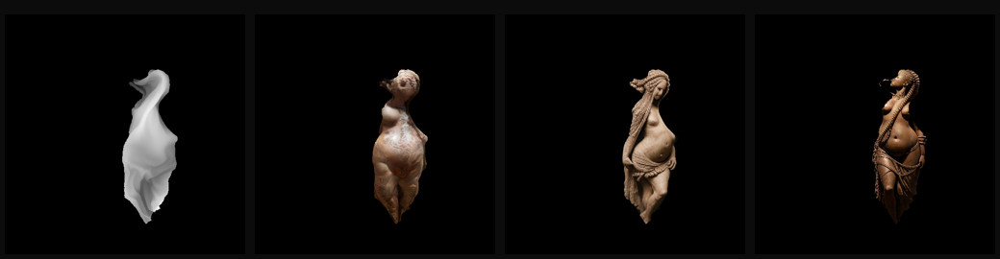

# Venus Veil

A translucent veil hovering in a dark studio, fluttering in wind. Drop a photo of a
prehistoric Venus figurine and the veil takes its shape: the depth map is estimated
in the browser, turned into a fabric texture, and used as a physics constraint so the
body is *felt* while the wind moves the cloth.

```
npm install
npm run dev        # http://127.0.0.1:5190
npm test           # solver / wind / texture math (node --test, no browser)
npm run build
```

Chrome with WebGPU is recommended (the depth model runs on the GPU in fp16). Without
WebGPU it falls back to WASM (q8), slower but identical results. The first run
downloads the model (~50 MB) once; the browser caches it.

## How it works

- `src/cloth/solver.js` — position-based cloth (XPBD compliance): stretch, shear and
  bending constraints, an implicit aerodynamic model (drag, skin drag, lift), a soft
  "hover" spring toward the rest shape, and, with a sculpture loaded, mask-weighted
  shape retention plus a one-sided relief collider so the cloth never sinks behind the body.
- `src/cloth/wind.js` — base flow × gust envelope + divergence-free curl-noise
  turbulence, evaluated on a lattice once per frame; pointer movement adds a local push.
- `src/render/veilMaterial.js` — `MeshPhysicalMaterial` with sheen and iridescence plus
  injected fresnel-driven opacity, thin-sheet back-light, and fold-density opacity.
- `src/render/studio.js` — low key spotlight with shadows, cool rim, softbox environment,
  raymarched volumetric beam, mirror floor with an additive lit pool.
- `src/pipeline/depth.worker.js` — Depth Anything V2 (small) via `@huggingface/transformers`.
- `src/pipeline/veilTexture.js` — photo → mask (luminance or depth, hole-filled), stone tint,
  density (alpha) map, detail normal map, and the relief grid for the solver.

## Recording

**Export › record a video** renders the clip frame by frame and waits for each generated
frame, so the file is smooth however slowly it was made. The panel itself is never in the
picture: only the render canvas is captured.

- **Format:** MP4 (H.264) by default, straight into any editor; WebM (VP9) if you prefer it.
  Frames are encoded through WebCodecs with an exact timestamp each, so a frame that took two
  seconds to make is still 1/60 s in the file. **Keep the tab in front while recording:** Chrome
  suspends video encoding in a hidden tab, so the recording pauses there and resumes when you
  come back.
- **Resolution:** the viewport, or a fixed 1280 × 720, 1920 × 1080 or 2560 × 1440.
- **Quality:** standard, high or master. At 1920 × 1080 / 24 fps that is about 5, 10 and
  20 Mbit/s.
- **Camera:** the view holds still for the first fifth of the clip (**still at start**), then
  eases into a slow orbit of **camera orbit** degrees, so a clip has movement of its own.
- **Generated resolution:** 256, 384 or 512 px for the diffusion.
- `Escape` stops early and keeps what was recorded. Recordings hold priority on the projector
  service, so another open tab cannot steal their frames.

Generated resolutions, measured on an M3 Pro (one frame, including the round trip):

| Generated | Per frame | Live rate |
|---|---|---|
| 256 px | ~40 ms | ~25 fps |
| 384 px | ~75 ms | ~13 fps |
| 512 px | ~110 ms | ~9 fps |

384 and 512 are meant for recording rather than live use. `npm run projector:setup` clones or
compiles all three; add more with
`.venv-projector/bin/python server/prepare_models.py --sizes 384 512`.

The defaults are already the high-quality ones: 3840 × 2160, 60 fps, master quality, 32 seconds,
generated at 512 with a new image 8 times a second, and a 40° orbit after a still opening.
That clip is 1920 frames and takes roughly 5 minutes, most of it waiting for the model. Hide the
panel with `H` first if you want to watch it being made; the panel is never in the picture. Older WebM clips convert with
`npm run to-mp4 -- <clip.webm>` (requires ffmpeg).

## Image engines

Two ways to make the projected image, chosen in **Export › image engine**. Live projection always
uses the fast one.

| Engine | What it is | Steps | Per frame at 512 px |
|---|---|---|---|
| live | SDXS DreamShaper distilled to one step, sketch ControlNet, Core ML | 1 | ~0.15 s |
| fine | DreamShaper 8 + depth ControlNet + LCM-LoRA, on Metal | 8 | ~11 s |
| best | DreamShaper 8 + depth ControlNet, DPM++ 2M Karras, guidance 4 | 18 | ~32 s |



*The same veil depth (left) through the three engines: live, fine, best.*

The two slow engines are a different kind of picture, not just more of the same one: they read the
**depth map itself** rather than edges traced from it, they sample properly instead of taking one
distilled step, and they use a negative prompt. They are for recordings; a frame takes seconds.

- **Carry:** each frame starts from the previous generated image (**carry previous frame**, 0.45),
  so stone stays stone and the light persists while the folds change. It also halves the cost. A
  recording resets it on the first frame.
- **Memory:** only one engine is resident. Asking for a slow engine unloads the fast one and takes
  20–30 s; it is released again after three idle minutes. Below about 1.2 GB free the service
  refuses with a message rather than dragging the machine into swap.
- **Timing:** a recording shows an estimate and asks for a second press when it will take more than
  two minutes. Choosing a slow engine drops **new image per second** to 6 (fine) or 2 (best), which
  with the crossfade still gives 60 fps motion. A 4 s clip at 60 fps on `best` with 2 images per
  second is 8 generated images, about 5 minutes.
- **This machine, honestly:** the times above are measured with nothing else running. With Chrome
  open and the system in swap, a `best` frame has taken up to 14 minutes here. Quit what you can
  before a long recording, and prefer `fine` for anything but a few hero frames.
- Weights (~2.5 GB: depth ControlNet, LCM-LoRA, DreamShaper 8 in fp16) come down with
  `npm run projector:setup`, and `.venv-projector/bin/python server/bench_engines.py` measures
  seconds per frame on your machine.

## Frame rate

The studio measures its own frame time and holds the rate above **Performance › minimum fps**
(24 by default). It lowers resolution first, then steps down the volumetric beam, the floor
reflection, the shadow refresh and multisampling. The readout next to the fps counter shows the
current resolution when it is below 100%. Turn **hold frame rate** off to pin the settings by hand.

## Looks

Five projector looks. Each one sets the whole studio at once — wind, cloth, surface, light,
post, sculpture — and drives the local diffusion service with its own prompt, so the veil
takes on a different material. `?look=bronze` opens straight into one; `?noprojector` starts
with projection off.

| Look | What it is |
|---|---|
| Limestone | weathered stone, the figure the sculptor carved (default) |
| Bronze | cast metal, oxidised green and copper |
| Ivory | projection over the lit cloth: pearl and carved ivory |
| Obsidian | smoked glass in a darker room |
| Wandering | the material drifts: stone, ivory, pearl, glass |

Until the first generated frame arrives — while the model loads, or with the service
stopped — the veil keeps its lit fabric look, so nothing ever goes invisible.

The panel shows a look, six essentials and the actions. **Expert controls** reveals the full
set: Wind, Cloth, Surface, Light, Sculpture, Projection and Performance.

## Controls

Drag to orbit, scroll to zoom, move the pointer through the veil to push it.
`Space` pause · `R` reset cloth · `S` save PNG · `H` hide UI. Drop or paste any PNG/JPEG/WebP.

Tuning tips: **Wind › turbulence / eddy size** make folds; **Cloth › softness / shear give**
make the sheet crumple more; **Surface › edge glow / back-light** are the organza look;
**Light › key / beam / exposure** set the mood; **Sculpture › relief / shape retention**
control how strongly the body holds its form against the wind.

## Live projection

The veil's depth, seen from a projector at your viewpoint, feeds a local one-step
diffusion model; the generated image comes back as light on the cloth, with fold
occlusion, and also plays on the round screen beside the veil.

```
npm run projector:setup   # once: Python env + Core ML models (Apple Silicon)
npm run projector         # service on 127.0.0.1:5193, ~30 s to load
```

Then open **Projection › live projection** in the panel, or `http://127.0.0.1:5190/?projector`.
The published page can use the same local service (Chrome may ask to allow local network access).

- **Model:** SDXS DreamShaper with its sketch ControlNet and tiny VAE, compiled to Core ML.
  The ControlNet is sketch-trained, so the veil's silhouette and fold edges are extracted
  from depth. With a sculpture loaded, its relief is part of that depth, so the body guides
  the image. Measured here: about 35 ms per frame on an M3 Pro, around 25 generated frames per second.
- **Modes:** *woven into fabric* keeps each image on the fabric points it was generated for,
  so the cloth runs at full frame rate while the light rides the folds. *Physical projector*
  keeps the image fixed in projector space and re-rasterises occlusion every frame.
  *Frame-locked pairs* advances the cloth 1/30 s per generated frame, so every pose is
  exactly the pose its image was made from.
- **Final image:** *diffusion only* (default) shows the generated result alone, floating in the
  studio; *fabric + light* keeps the lit veil and adds the projection on top.
- **What the model sees:** the wind-shaped cloth alone. The capture is stretched over the
  veil's own near/far range so folds read as shape, with nothing painted into it, and it is
  turned upright first (**figure upright for model**), because the model reads a standing form
  far better than a reclining one. The figure comes from the prompt and from however much the
  sculpture shapes the cloth itself. **Sculpture in depth map** mixes the relief back into the
  capture for a more literal body; 0 by default.
- **While projecting, the cloth flies free:** the relief still drives the image but holds the
  sheet only slightly (**sculpture in physics**, 0.25 by default; 0 removes it entirely).
- **Occlusion** is captured at 512 px and filtered over 3×3 taps, so fold shadows have soft
  edges instead of stepping along the projector's pixel grid; the model is fed a
  box-averaged 256 px copy of the same capture.
- **Every image is committed atomically** with its capture pose, projector matrix and depth
  buffer into one of two slots, which crossfade (**frame blend**).
- **Material wandering** blends the prompt through limestone, ivory, mother of pearl and
  smoky glass. **Calibration grid** checks placement and occlusion.
- `src/projection/rasterDepth.js` rasterises the veil's depth on the CPU (about 0.6 ms at
  256 px) to avoid a GPU readback stall; the request is binary (depth bytes in, raw RGBA out).
- Tests: `npm test` covers the rasteriser and protocol; `npm run test:server` covers the
  service's request parsing, CORS and private-network preflight without loading the model.

Adapted from the live projection study in the sibling `veil-ribbon-lab` project.
